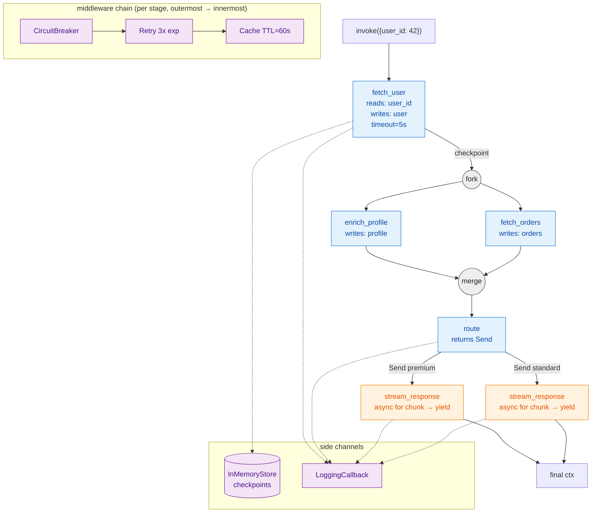

# fluxio

Streamable, durable pipeline runtime for Python backend services.

📖 **Documentation:** [English](https://cop1cat.github.io/fluxio/) · [Русский](https://cop1cat.github.io/fluxio/ru/)

- **Composable stages** with auto-detected sync/async/stream types
- **Immutable HAMT context** with O(1) fork / conflict-aware merge
- **Auto-parallelism** from declared `reads`/`writes`
- **Durable execution** with checkpoints and explicit `resume`
- **Conditional routing** via `Send` and `dict` blocks
- **Middleware chain**: retry, cache, circuit breaker, rate limit
- **Observability** via callbacks (Langfuse integration included)

## Install

```bash
pip install fluxio              # core
pip install fluxio[redis]       # RedisStore
pip install fluxio[langfuse]    # LangfuseCallback
```

Requires Python 3.12+.

## Minimal example

```python
from fluxio import Pipeline, stage

@stage
async def fetch_user(ctx):
    return ctx.set("user", {"id": ctx["user_id"], "name": "Alice"})

@stage
async def greet(ctx):
    return ctx.set("greeting", f"Hello {ctx['user']['name']}")

async def main():
    async with Pipeline([fetch_user, greet]) as pipe:
        result = await pipe.invoke({"user_id": 1})
        print(result["greeting"])
```

## Production example

```python
from fluxio import (
    Pipeline, Parallel, stage, Send,
    RetryMiddleware, CacheMiddleware, CircuitBreakerMiddleware,
    InMemoryStore, LoggingCallback,
)

@stage(reads=frozenset({"user_id"}), writes=frozenset({"user"}), timeout=5.0)
async def fetch_user(ctx): ...

@stage(reads=frozenset({"user"}), writes=frozenset({"profile"}))
async def enrich_profile(ctx): ...

@stage(reads=frozenset({"user_id"}), writes=frozenset({"orders"}))
async def fetch_orders(ctx): ...

@stage
async def route(ctx):
    return Send("premium" if ctx["user"]["tier"] == "pro" else "standard")

@stage
async def stream_response(ctx):
    async for chunk in llm.stream(ctx["prompt"]):
        yield chunk

async with Pipeline(
    [
        fetch_user,
        Parallel([enrich_profile, fetch_orders]),  # or declare reads/writes and let auto-parallel kick in
        route,
        {
            "premium":  [stream_response],
            "standard": [stream_response],
        },
    ],
    middleware=[
        CircuitBreakerMiddleware(failure_threshold=5),
        RetryMiddleware(max_attempts=3, backoff="exponential"),
        CacheMiddleware(ttl=60),
    ],
    callbacks=[LoggingCallback()],
    checkpoint_store=InMemoryStore(),
    durable=True,
) as pipe:
    result = await pipe.invoke({"user_id": 42}, run_id="req-abc-123")

    # resume from checkpoint after a crash
    result = await pipe.invoke({}, run_id="req-abc-123", resume=True)
```

### How the pipeline above executes



- Solid arrows = data flow between stages (each step passes a new immutable `Context`).
- Dotted arrows = side channels: checkpoints and callbacks, invisible to stage logic.
- The `fork / merge` pair is an implicit `Parallel` block — branches run concurrently and their writes are merged back (with conflict detection).
- `Send("premium")` from `route` drives the `dict` branch selection; only one route body runs per invocation.
- `STREAM` stages (orange) bypass `RetryMiddleware` and `CacheMiddleware` automatically so chunks aren't duplicated or frozen in cache.

## Streaming

```python
async with Pipeline([fetch_user, stream_response]) as pipe:
    async for chunk in pipe.stream({"user_id": 42}):
        await websocket.send(chunk)
```

## Testing

```python
from fluxio import stage
from fluxio.testing.harness import StepHarness

async def test_fetch_user():
    harness = StepHarness(fetch_user)
    result = await harness.run({"user_id": 1})
    assert result["user"]["name"] == "Alice"
    harness.close()
```

## Layout

```
fluxio/
  api/          # Pipeline, Parallel, @stage, primitives
  compiler/     # bytecode + static analysis
  context/      # immutable HAMT
  runtime/      # interpreter, scheduler, middleware, cache
  observability/# callbacks: Base, Logging, Langfuse
  store/        # CheckpointStore: InMemory, Redis
  testing/      # StepHarness, make_ctx
```

## License

[MIT](LICENSE)
